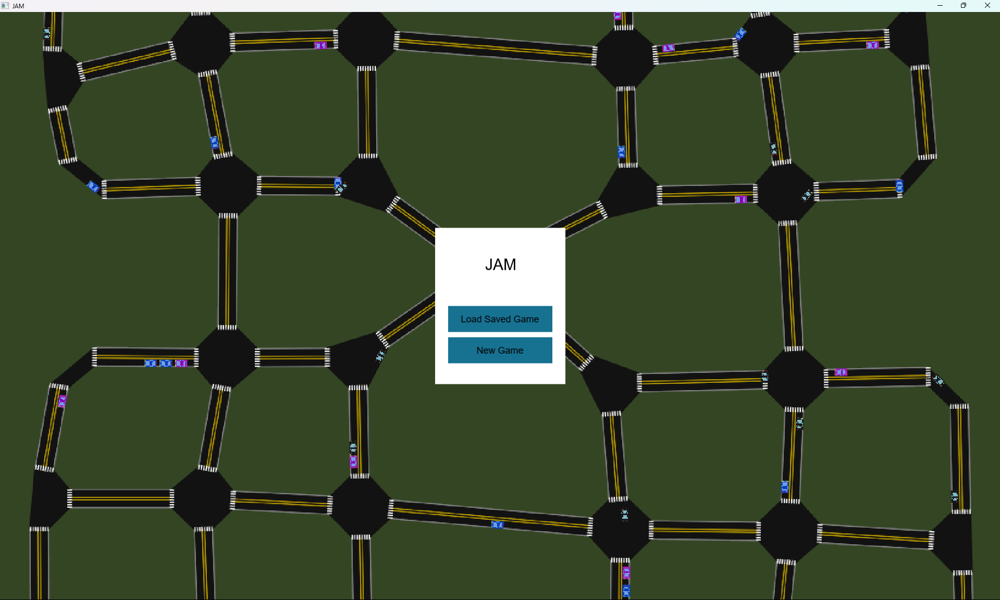
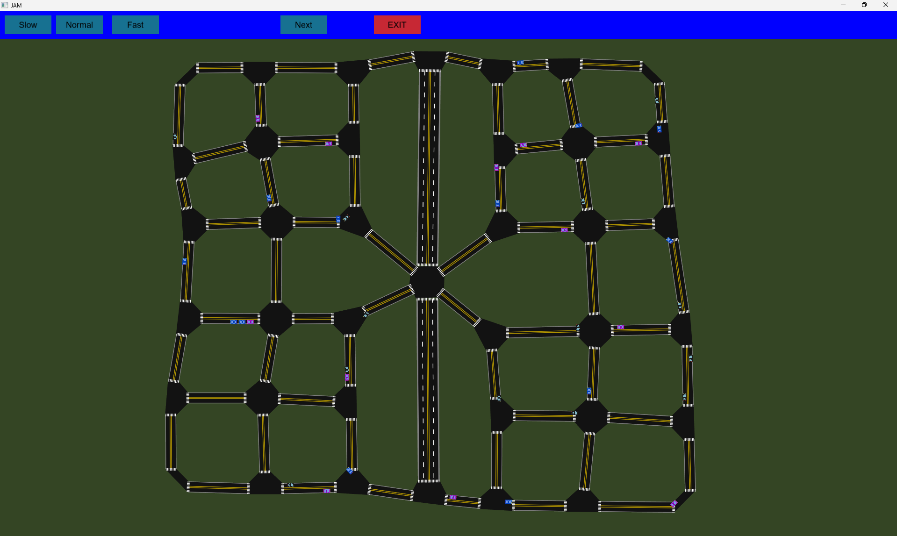

# JAM
JAM is a video game where you build the road network of a city and manage traffic.
[Jump to quickstart](#quickstart)
[Jump to controls](#controls)

<small>Tested on Windows and Linux Ubuntu</small>

# Quickstart

I strongly recommend you check out the [controls](#controls) section before you play the game!

1) Download the ZIP file for your operating system here: https://github.com/tiydwe/jam/releases. If there are two versions, download the static version (the shared version has known issues on some OS).
For example, if you are using windows, you should download `Windows.zip`.

2) Extract all files into a location of your choice.
3) Run `main` depending on what OS you have. 
4) Check out the [controls](#controls) section before you play the game!

## My computer is blocking me from running `main`!

Follow these steps to unblock the executable:

### MacOS

1) Attempt to run it.
2) Open the Apple Menu and select System Settings
3) Click Privacy & Security
4) Go to the Security section
5) Click Open Anyway next to the message about the executable you just tried to run
6) Enter your password and click Open to confirm

### Windows

1) Click the <u>More info</u> text.
2) Click Run Anyway

### Linux

1) Open a terminal
2) Navigate to the folder you extracted the files into
3) Run `chmod +x main`

# Features
* Place multiple different types of roads
* Watch cars try to navigate your road network
* See how well you did!
* Save / load games

# Controls
* To pan: right click + drag
* Zoom in/out: scroll
* Cancel road building (if you have already clicked and started building the road): `esc`
* Hover over cars to see their destination

# How it works
Jam is built off of a custom made traffic engine. Internally, roads are represented as individual one-way edges on a graph and intersections as nodes. To create the UI, a seperate set of classes represent the physical aspects of objects. This keeps the responsibilities seperate and allows simulation to be seperate from the layout. Smart pointers are extensivly used throughout the project to clarify ownership and ease memory management.

Routes are decided using Dijkstra's algorithm with custom penalties for intersections and speed limits. Cars also intelligently merge lanes and traffic lights auto generate schedules to ensure no cars crash.

The game was built off of SFML and portable-file-dialogs without any additional helpers. Every single UI element was created by hand.

<small>For more technical details, check out the devlogs here: https://stardance.hackclub.com/projects/56391</small>

# AI use declaration
The only AI use of any kind on this project was to help write/fix github actions scripts (release.yml and ci.yml). AI was not used to write, edit, or debug anything else in this project.

# Credits
Thank you so much to [SFML](https://github.com/sfml/sfml) and [portable file dialogs](https://github.com/samhocevar/portable-file-dialogs)! The Montserrat font was used in this project. The license and attribution is [here](/assets/fonts/OFL.txt).